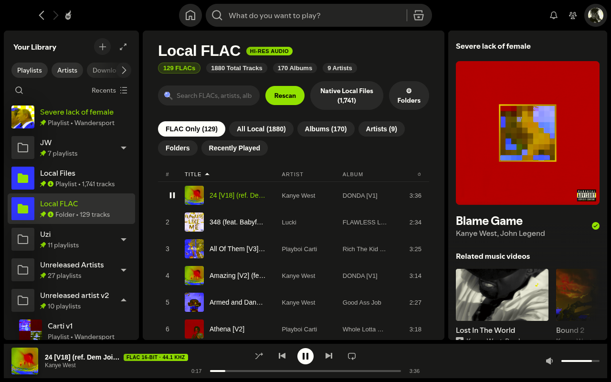
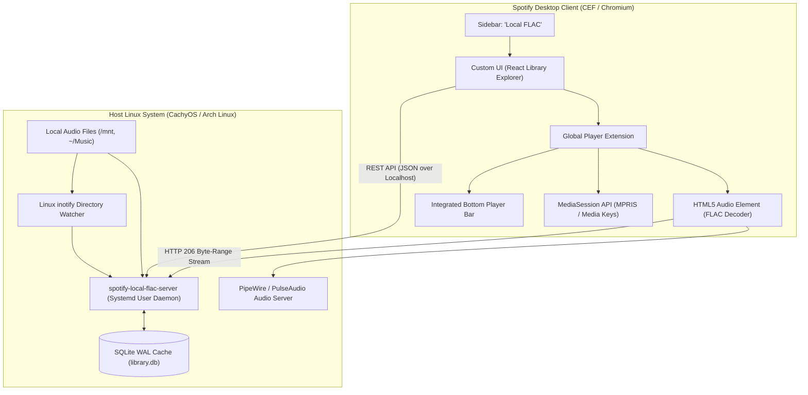

# Spotify Local FLAC 🎵

> Production-quality modification and companion service for the Spotify desktop client adding first-class browsing and native-fidelity playback for local FLAC and hi-res audio files.



*Native-styled Local FLAC library with sortable Title, Artist, and Album columns, lossless playback, cover art, hierarchical folder explorer, and integrated bottom player.*

---

## Features

### 1. Library Browsing & Search
- **Dedicated Route (`/local-flac`)**: Docked directly into Spotify's sidebar next to native "Local Files".
- **Sortable Track Table**: Interactive ascending and descending sorting on **TITLE**, **ARTIST**, and **ALBUM** columns with locale-aware ordering (handling numbers, accents, and punctuation) and visible row numbering.
- **Dedicated Artist Column**: Clean artist column matching Spotify's native layout: `#`, `TITLE`, `ARTIST`, `ALBUM`, `⏱`.
- **Filter Chips**: Spotify-native styled pills for quick filtering:
  - **FLAC Only (129)**
  - **All Local (1,880)**
  - **Albums (170)**
  - **Artists (9)**
  - **Folders**
  - **Recently Played**
- **Hierarchical Folder Explorer**: Breadcrumb navigation for directory trees with subfolder drill-down, empty-folder handling, and direct playback of entire folders.
- **Album & Artist Grids**: Visual card grids with embedded cover art extraction and track counts.
- **Instant Search**: Real-time filtering across titles, artists, albums, and folder paths.

### 2. Lossless Playback & Native Spotify Integration
- **Lossless FLAC Streaming**: Direct FLAC audio streaming via HTTP 206 byte-range requests with instant seeking.
- **Integrated Bottom Player Bar**: Docked into Spotify's bottom bar with track title, artist, album art, audiophile format badge (e.g. `FLAC 16-BIT · 44.1 KHZ`, `FLAC 24-BIT · 96 KHZ`), seekbar, and volume slider.
- **Single-Active-Owner State Machine**: Seamless coordination between Spotify native playback and Local FLAC. Starting Spotify streams automatically pauses Local FLAC; playing a FLAC pauses Spotify.
- **Settings Toggle**: Integrated toggle in Spotify Preferences (`/preferences`) to show or hide "Show Local FLAC" and quick access to manage music directories.
- **System Media Keys & MPRIS**: Keyboard media keys, lock screen controls, and KDE Plasma/Wayland notifications work natively via `navigator.mediaSession`.
- **Keyboard Shortcuts**:
  - `Space`: Play / Pause
  - `Ctrl + ArrowRight`: Next track
  - `Ctrl + ArrowLeft`: Previous track
  - `Shift + ArrowRight`: Seek forward 5s
  - `Shift + ArrowLeft`: Seek backward 5s

### 3. Background Directory Watcher
- Continuous directory monitoring via Linux `inotify`.
- Newly added music files and folders are automatically indexed without requiring client restarts.

---

## Architecture



---

## How It Works

1. **Zero Spotify DRM Modification**: Spotify's proprietary DRM streaming pipeline is left untouched. Local FLAC operates exclusively on your own offline audio files.
2. **Lossless FLAC Playback Without Transcoding**: Spotify's desktop interface runs inside Chromium (CEF), which includes native FLAC decoding capabilities. The companion extension routes local audio through an HTML5 audio element fed by the local streaming server.
3. **Local Companion Daemon**: A lightweight Python service runs as a systemd user daemon, indexing local audio files into SQLite (WAL mode) and serving HTTP 206 partial content streams with localhost-only token authentication.

---

## Installation

### Prerequisites
- Spotify installed either via **Flatpak** (`com.spotify.Client`) or native Arch/CachyOS package.
- Python 3.10+ with `sqlite3`.
- `spicetify-cli`.

### Clone & Install
```bash
cd ~/Projects
git clone https://github.com/Wandersport/spotify-local-flac.git
cd spotify-local-flac
./install.sh
```

The installer will:
1. Detect your Spotify client and configure Spicetify.
2. Install the companion daemon to `~/.local/share/spotify-local-flac/`.
3. Auto-detect your music directories (including `~/Music` and mounted drives).
4. Create and enable the `spotify-local-flac.service` systemd user service.
5. Apply the Spicetify Custom App and Extension to Spotify.

---

## Configuration

Configuration is stored in:
```text
~/.config/spotify-local-flac/config.json
```

Example configuration:
```json
{
  "host": "127.0.0.1",
  "port": 18492,
  "music_directories": [
    "/home/admin/Music",
    "/mnt/1TB/[copias]/Music/[NEW MUSIC FOLDERS]"
  ],
  "exclude_patterns": [
    "*recycle*",
    "*trash*",
    "*lost+found*"
  ],
  "supported_extensions": [
    ".flac",
    ".alac",
    ".wav",
    ".mp3",
    ".ogg",
    ".m4a",
    ".opus",
    ".aiff"
  ],
  "database_path": "/home/admin/.local/share/spotify-local-flac/library.db",
  "watch_directories": true,
  "log_level": "INFO"
}
```

> [!NOTE]
> Hidden system/version control directories (e.g. `.git/`, `.cache/`, `.DS_Store`) are excluded automatically. Legitimate audio files whose filenames begin with a dot (such as `.223...mp3`) are fully supported and indexed.

### Adding Music Directories
- **Via Spotify UI**: Open **Local FLAC** → click **⚙ Folders** → enter path → **Add Folder**.
- **Via Config File**: Add the directory to `"music_directories"` in `config.json` and restart the service.

---

## Updating

When Spotify is updated via Flatpak or package manager:
```bash
cd ~/Projects/spotify-local-flac
./update.sh
```

---

## Service Management

The companion service runs as a systemd user unit:
```bash
# Check service status
systemctl --user status spotify-local-flac.service

# View live service logs
journalctl --user -u spotify-local-flac.service -f

# Restart service
systemctl --user restart spotify-local-flac.service

# Stop service
systemctl --user stop spotify-local-flac.service
```

---

## Technical Notes / Native Spotify Limitations

Spotify's native desktop client hardcodes support strictly for `.mp3`, `.m4a`, and `.mp4` files via its internal `libplayback` scanner:

| Storage Inventory | Track Count | Formats Included |
| :--- | :--- | :--- |
| **Files on Disk** | **1,880** | 129 FLAC, 1,604 MP3, 137 M4A (136 AAC, 1 ALAC), 10 WAV |
| **Spotify Native "Local Files"** | **1,741** | 1,604 MP3, 137 M4A *(FLAC & WAV excluded)* |
| **Local FLAC Integration** | **1,880** | 129 FLAC, 1,604 MP3, 137 M4A, 10 WAV *(100% indexed)* |

Because native Spotify lacks a FLAC demuxer in its closed-source playback pipeline:
- Native Spotify drops FLAC files during local scanning and rejects synthetic `spotify:local:...` FLAC URIs with `command_not_allowed`.
- FLAC tracks cannot be placed into native Spotify server-synced cloud playlists.
- Local FLAC bridges this limitation by providing full, lossless playback in the client with dedicated library browsing, folder navigation, and synchronized queue management.

For complete forensic analysis and disassembly notes, refer to [AUDIT.md](AUDIT.md).

---

## Uninstallation

To restore Spotify to its original unmodified state and remove the background service:
```bash
cd ~/Projects/spotify-local-flac
./uninstall.sh

# Or to also purge configuration and database:
./uninstall.sh --purge
```

---

## Security & Privacy

- **Localhost Binding**: The companion daemon binds strictly to `127.0.0.1` and never opens external network ports.
- **Path Traversal Sanitization**: All file requests are canonicalized with `os.path.realpath` and checked against allowed directories. Traversal attempts outside configured music directories are rejected with `403 Forbidden`.
- **Bearer Authentication**: An automatically generated 256-bit token (`~/.config/spotify-local-flac/token`, permission `0600`) authenticates all API and streaming requests.
- **Zero Telemetry**: No analytics, telemetry, or personal data leaves your local machine.

---

## License

MIT License. See [LICENSE](LICENSE) for details.
