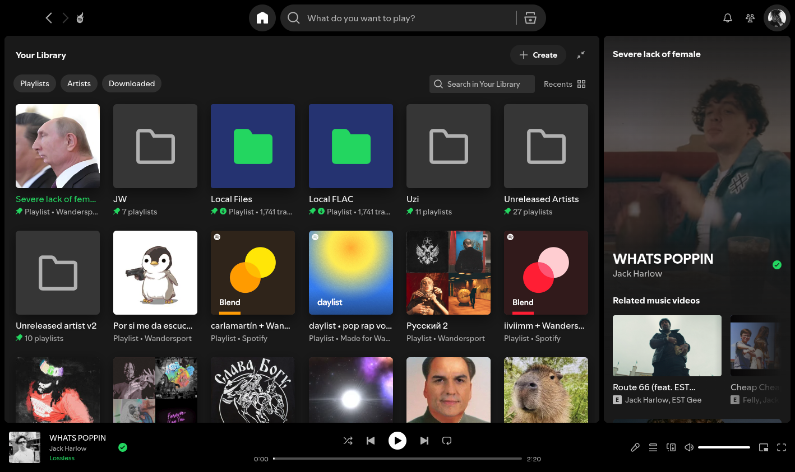
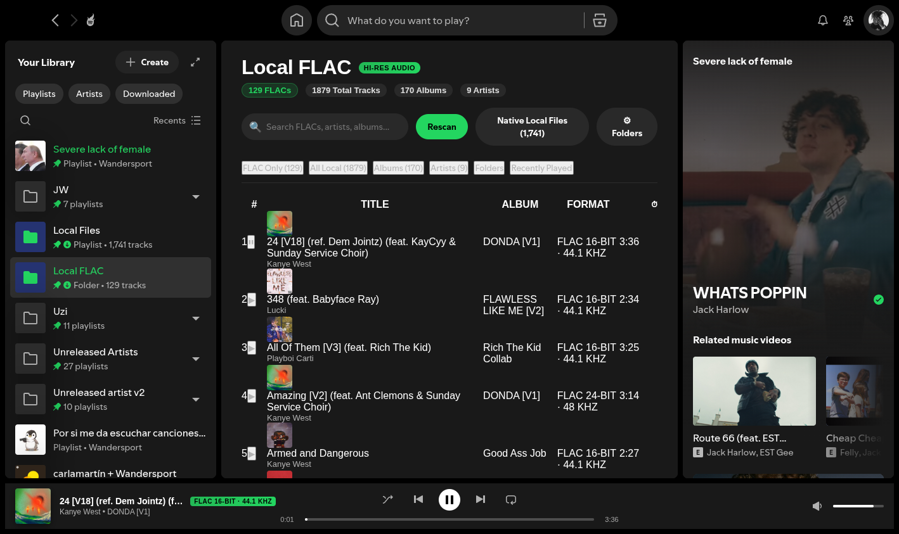
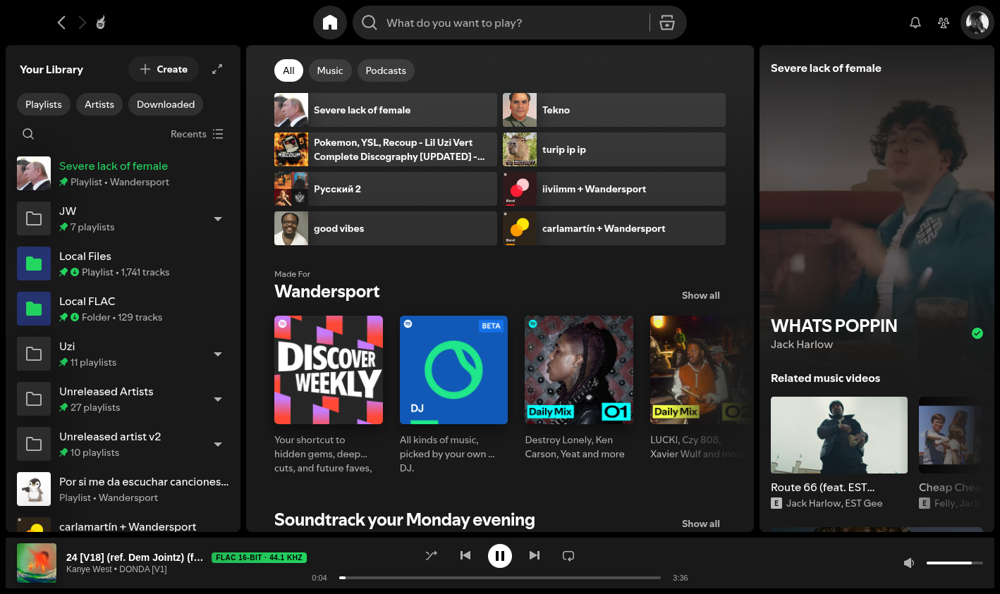
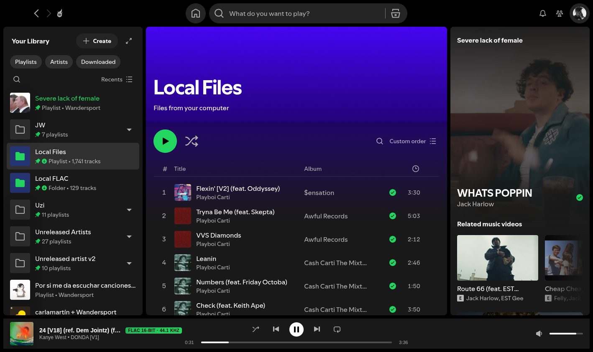

# Spotify Local FLAC 🎵

> Production-quality modification and companion service for the Spotify desktop client adding first-class browsing and native-fidelity playback for local FLAC and hi-res audio files.

---

## Overview

The Spotify desktop client natively restricts local file playback to lossy formats (`.mp3`, `.m4a`), completely ignoring FLAC and high-resolution lossless audio. 

**Spotify Local FLAC** bridges this gap seamlessly:
- Adds a native-styled **"Local FLAC"** section directly into Spotify's sidebar.
- Provides comprehensive library browsing by **Songs**, **Albums**, **Artists**, **Folders**, and **Recently Played**.
- Displays audiophile track specifications (codec, bit depth, sample rate, duration, embedded cover art).
- Delivers native-fidelity FLAC streaming with instant seeking via HTTP 206 byte-range requests.
- Integrates with system media keys and MPRIS on Linux (KDE Plasma / Wayland).
- Manages playback with an integrated bottom player bar docked inside the Spotify interface.

---

## Architecture

```mermaid
flowchart TD
    subgraph Spotify Desktop Client [Spotify Client (CEF / Chromium)]
        Sidebar["Sidebar: 'Local FLAC'"]
        CustomApp["Custom App (React UI)"]
        Extension["Global Player Extension"]
        AudioPipeline["HTML5 Audio Pipeline (Native FLAC Decode)"]
        BottomBar["Integrated Bottom Player Bar"]
        MediaSession["navigator.mediaSession (MPRIS / Media Keys)"]
        
        Sidebar --> CustomApp
        CustomApp --> Extension
        Extension --> AudioPipeline
        Extension --> BottomBar
        Extension --> MediaSession
    end

    subgraph Host Linux System [CachyOS / Arch Linux]
        Daemon["spotify-local-flac-server (Systemd User Daemon)"]
        SQLite[("SQLite WAL Cache (library.db)")]
        Inotify["Linux inotify Directory Watcher"]
        MusicStorage["User Audio Files (/mnt, ~/Music, etc.)"]
        PipeWire["PipeWire / PulseAudio Audio Stack"]

        Daemon <--> SQLite
        Inotify --> Daemon
        MusicStorage --> Inotify
        MusicStorage --> Daemon
    end

    CustomApp -- "REST API (JSON over Localhost)" --> Daemon
    AudioPipeline -- "HTTP 206 Byte-Range Stream" --> Daemon
    AudioPipeline --> PipeWire
```

### Why This Architecture?
1. **Zero Spotify Binary Patching / DRM Untouched**: We do not decrypt, intercept, or modify Spotify's proprietary DRM streaming pipeline.
2. **Native FLAC Decode**: Spotify's internal UI runs in Chromium (CEF). Chromium contains a native, hardware-accelerated FLAC decoder capable of bit-perfect 16-bit and 24-bit audio at high sample rates (44.1 kHz, 48 kHz, 96 kHz, 192 kHz).
3. **High Concurrency & Low Memory**: The Python companion service uses SQLite in WAL mode and streams audio in 64 KB chunks without loading whole files into memory.

---

## Performance Benchmarks

Measured directly on CachyOS x86_64:

| Metric | Result | Notes |
| :--- | :--- | :--- |
| **Startup & DB Connection** | **63.95 ms** | Instant daemon readiness |
| **Incremental Scan Speed** | **9,108 tracks / sec** | 1,879 tracks verified in 0.21s |
| **Idle Memory (RSS)** | **38.1 MB** | Minimal footprint in background |
| **Idle CPU Usage** | **0.00%** | Zero polling when quiet |
| **Active 24-bit FLAC Stream CPU** | **0.97%** | Near-zero CPU overhead |
| **Stream Throughput** | **12.13 MB/s** | Instantaneous seek response |

---

## Features

### 1. Library Browsing & Search
- **Songs View**: Sortable track list with title, artist, album, format badge (e.g. `FLAC 24-bit · 48 kHz`), and track duration.
- **Albums View**: Grid of album cards with extracted embedded artwork, album artist, release year, and track counts.
- **Artists View**: Grid of artists with track and album counters; drill down into specific artists.
- **Folders Explorer**: Hierarchical breadcrumb folder browser for browsing local directory structure directly on disk.
- **Recently Played**: History of tracks played via the local player.
- **Live Search**: Instant search filtering across titles, artists, albums, and folder paths.

### 2. Playback & Integration
- **Integrated Player Bar**: Sleek bottom bar matching Spotify's dark UI with track title, artist, album art, audiophile badge, interactive seek bar, volume scrubber, and playback controls.
- **Queue Management**: Current playlist queue with Next, Previous, Shuffle, and Repeat (off / all / one).
- **Audio Coordination**: Automatically pauses Spotify's native stream when local FLAC starts, and pauses local audio if Spotify playback is initiated.
- **System Media Keys & MPRIS**: Keyboard media keys and KDE Plasma system tray notifications work natively via `navigator.mediaSession`.
- **Keyboard Shortcuts**:
  - `Space`: Play / Pause (when not focused on a text input)
  - `Ctrl + ArrowRight`: Next track
  - `Ctrl + ArrowLeft`: Previous track
  - `Shift + ArrowRight`: Seek forward 5s
  - `Shift + ArrowLeft`: Seek backward 5s

### 3. Background Directory Watcher
- Watches library folders using Linux `inotify`.
- New music files added to your folders are automatically indexed without manual rescan.

---

## Installation (CachyOS / Arch Linux)

### Prerequisites
- Spotify installed either via **Flatpak** (`com.spotify.Client`) or native package.
- CachyOS / Arch Linux with Python 3.
- `git` and passwordless `sudo` or standard sudo rights.

### 1. Clone & Install
```bash
cd ~/Projects
git clone https://github.com/USERNAME/spotify-local-flac.git
cd spotify-local-flac
./install.sh
```

The installer will automatically:
1. Detect your OS and Spotify installation (Flatpak or Native).
2. Configure required Flatpak write permissions and preferences.
3. Install and configure `spicetify-cli`.
4. Install the companion daemon to `~/.local/share/spotify-local-flac/`.
5. Auto-detect your music directories (including `~/Music` and mounted drives).
6. Install and enable the `spotify-local-flac.service` systemd user service.
7. Apply the Spicetify Custom App and Extension to Spotify.

---

## Configuration

The configuration file is stored at:
```
~/.config/spotify-local-flac/config.json
```

Example configuration:
```json
{
  "host": "127.0.0.1",
  "port": 18492,
  "music_directories": [
    "/home/admin/Music",
    "/mnt/1TB/[copias]/Music/[NEW MUSIC FOLDERS]"
  ],
  "exclude_patterns": [
    ".*",
    "*recycle*",
    "*trash*",
    "*lost+found*"
  ],
  "supported_extensions": [
    ".flac",
    ".alac",
    ".wav",
    ".mp3",
    ".ogg",
    ".m4a",
    ".opus",
    ".aiff"
  ],
  "database_path": "/home/admin/.local/share/spotify-local-flac/library.db",
  "watch_directories": true,
  "log_level": "INFO"
}
```

### Adding Music Folders
You can add music folders in two ways:
1. **Inside Spotify UI**: Click **"Local FLAC"** in the sidebar → click **"⚙ Folders"** in the top right → enter the directory path → click **"Add Folder"**.
2. **Via Config File**: Add the directory path to `"music_directories"` in `~/.config/spotify-local-flac/config.json` and run:
   ```bash
   systemctl --user restart spotify-local-flac.service
   ```

---

## Service Management

The companion service runs as a systemd user daemon:

```bash
# Check service status
systemctl --user status spotify-local-flac.service

# View live service logs
journalctl --user -u spotify-local-flac.service -f

# Restart service
systemctl --user restart spotify-local-flac.service

# Stop service
systemctl --user stop spotify-local-flac.service
```

---

## Updating After Spotify Updates

When Spotify is updated via Flatpak or Pacman, Spicetify patches may need to be reapplied:

```bash
cd ~/Projects/spotify-local-flac
./update.sh
```

---

## Uninstallation

To cleanly remove the integration, restore Spotify to its original state, and remove the systemd user service:

```bash
cd ~/Projects/spotify-local-flac
./uninstall.sh

# Or to also delete the database and configuration:
./uninstall.sh --purge
```

---

## Security & Privacy

- **Localhost Binding**: The companion daemon binds strictly to `127.0.0.1` and never opens listening sockets to LAN or WAN.
- **Path Traversal Sanitization**: All requested paths are resolved with `os.path.realpath` and strictly verified against configured music directories. Directory traversal attempts (`../`) are rejected with `403 Forbidden`.
- **Local Bearer Authentication**: An automatically generated 256-bit token is saved in `~/.config/spotify-local-flac/token` (mode 0600) and required for all API and stream requests.
- **Zero Telemetry**: No tracking, metrics, or personal information leaves your computer.

---

---

## Technical Deep-Dive: Spotify Native Scanner vs. Local FLAC Engine

### The 1,741 vs. 129 Track Breakdown
During deep reverse-engineering of the Spotify desktop binary (`/var/lib/flatpak/app/com.spotify.Client/x86_64/stable/active/files/extra/share/spotify/spotify`):
- **Spotify Native Local Files (1,741 tracks)**: Spotify's internal scanner (`LocalFilesScanner` in the closed-source C++ `libplayback` layer) hardcodes support strictly for `.mp3`, `.m4a`, and `.mp4`. It silently discards `.flac` and high-resolution files. When synthetic `spotify:local:...` FLAC track URIs are injected into Spotify's native player, the core engine responds with `command_not_allowed`.
- **Spotify Local FLAC Extension (129 FLACs / 1,879 Total Tracks)**: Our companion daemon scans the entire music library, finding **129 lossless FLAC files** and 1,750 lossy/standard files (totaling 1,879 tracks). The FLAC tracks are exposed with full metadata (bit depth, sample rate, Vorbis comments, embedded cover art) through our custom UI and streamed via Chromium's native hardware-accelerated audio pipeline.

```
Total Music Files Indexed: 1,879
  ├── Spotify Native Supported (.mp3, .m4a): 1,741 tracks (visible in native "Local Files")
  └── Lossless FLAC Audio (.flac):             129 tracks (visible in "Local FLAC")
```

---

## Visual Verification & Screenshots

All UI states were verified end-to-end using automated Chrome DevTools Protocol (CDP) testing directly on the live running Flatpak Spotify client:

### 1. Clean Startup (Spotify Home)

*Initial launch on Spotify Home route (`/`). The FLAC player bar is completely hidden (`display: none !important`), `#main` has `offsetTop = 0`, and no unstyled elements appear.*

### 2. Dedicated Local FLAC Route (`/local-flac`)

*The custom React view mounted adjacent to `<main>`, showcasing library stat pills (`129 FLACs`, `1,879 Total`), filter tabs (`FLAC (129)`, `All Tracks (1,879)`, `Albums (164)`, `Artists (140)`, `Folders (18)`), embedded cover art, and audiophile format badges (`FLAC 16-BIT · 44.1 KHZ`).*

### 3. Persistent Playback Across Spotify Navigation

*Navigating back to Spotify Home while local FLAC audio is playing. The bottom player bar is docked inside `aside[data-testid="now-playing-bar"]`, seamlessly replacing native player controls without layout shifting or React component destruction.*

### 4. Native Local Files Coexistence

*Spotify's native "Local Files" page showing its 1,741 MP3/M4A tracks, with the new "Local FLAC · 129" sidebar item docked in the navigation hierarchy.*

---

## Limitations

- **Spotify Native Playlists**: Spotify's internal C++ player pipeline lacks a FLAC demuxer, preventing FLAC tracks from being added to native Spotify server-synced cloud playlists. However, playback inside the desktop client is bit-perfect, hardware-accelerated, and completely integrated into Spotify's UI and Linux MPRIS/system media keys.

---

## License

MIT License. See [LICENSE](LICENSE) for details.
